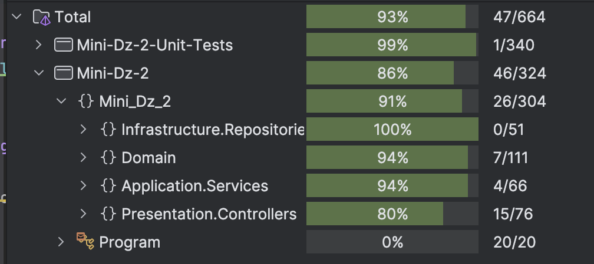
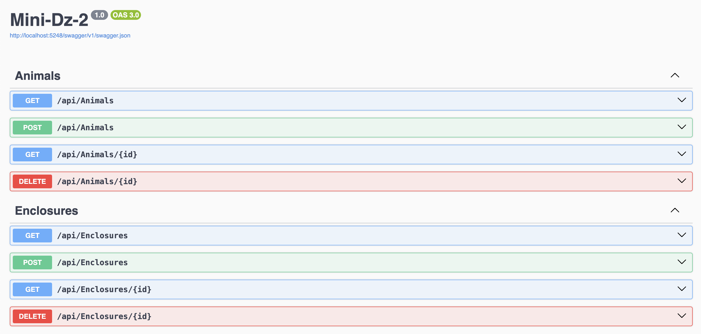
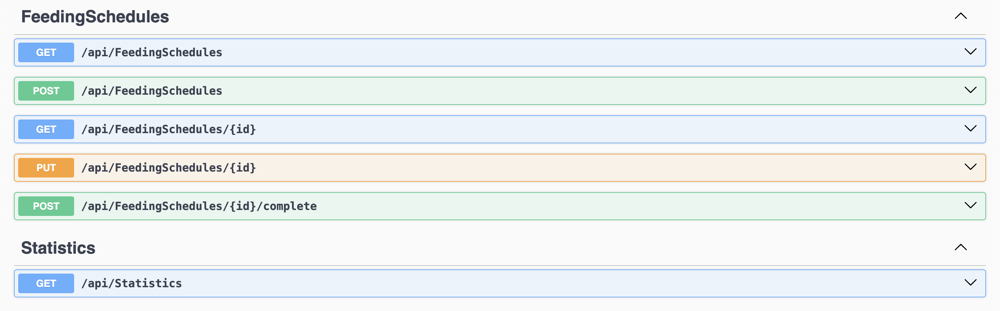

<h1>Отчет по Мини-Дз 2</h1>

<h2>1. Функционал</h2>
<ul>
  <li>
    <strong>Управление животными:</strong>
    <ul>
      <li><em>Добавление/удаление животного</em> – реализовано в <code>AnimalsController</code> (Presentation Layer) и поддерживается через in‑memory репозиторий (<code>InMemoryAnimalRepository</code> в Infrastructure Layer).</li>
      <li><em>Просмотр информации о животных</em> – реализовано через методы <code>GetAll()</code> и <code>GetById()</code> в <code>AnimalsController</code>.</li>
    </ul>
  </li>
  <li>
    <strong>Управление вольерами:</strong>
    <ul>
      <li><em>Добавление/удаление вольера</em> – реализовано в <code>EnclosuresController</code> с обращением к <code>InMemoryEnclosureRepository</code>.</li>
      <li><em>Просмотр информации о вольерах</em> – методы <code>GetAll()</code> и <code>GetById()</code> контроллера предоставляют соответствующий функционал.</li>
    </ul>
  </li>
  <li>
    <strong>Перемещение животных между вольерами:</strong>
    <ul>
      <li>Функционал реализован в сервисе <code>AnimalTransferService</code> (Application Layer), который использует репозитории животных и вольеров для перемещения. Доменные события фиксируются через <code>AnimalMovedEvent</code> в Domain Layer.</li>
    </ul>
  </li>
  <li>
    <strong>Расписание кормления:</strong>
    <ul>
      <li><em>Просмотр расписания кормлений</em> – метод <code>GetAll()</code> в <code>FeedingSchedulesController</code> возвращает список всех расписаний, реализованных через in‑memory репозиторий <code>InMemoryFeedingScheduleRepository</code>.</li>
      <li><em>Добавление нового кормления</em> – реализовано в <code>FeedingOrganizationService</code> (Application Layer) с последующим вызовом метода из <code>FeedingSchedulesController</code>.</li>
      <li><em>Изменение расписания и отметка кормления как выполненного</em> – также реализованы методами сервиса, позволяющими редактировать расписание и генерировать доменное событие <code>FeedingTimeEvent</code>.</li>
    </ul>
  </li>
  <li>
    <strong>Статистика зоопарка:</strong>
    <ul>
      <li>Сбор статистики (общее число животных, количество вольеров, число свободных вольеров) выполнен в сервисе <code>ZooStatisticsService</code> (Application Layer) и доступен через <code>StatisticsController</code> в Presentation Layer.</li>
    </ul>
  </li>
</ul>

<h2>2. Применение Domain-Driven Design и Clean Architecture</h2>
<ul>
  <li>
    <strong>Domain-Driven Design (DDD):</strong>
    <ul>
      <li>
        <em>Фокус на доменной модели:</em> все ключевые сущности (<code>Animal</code>, <code>Enclosure</code>, <code>FeedingSchedule</code>) находятся в Domain Layer. Каждая из них инкапсулирует свою бизнес-логику.
      </li>
      <li>
        <em>Использование доменных событий:</em> события <code>AnimalMovedEvent</code> и <code>FeedingTimeEvent</code> фиксируют важные изменения в системе и позволяют отслеживать процессы, находящиеся в Domain Layer.
      </li>
      <li>
        <em>Value Objects и перечисления:</em> для представления таких аспектов, как пол животного (<code>Gender</code>), статус (<code>AnimalStatus</code>) и тип вольера (<code>EnclosureType</code>), используются перечисления, что облегчает управление.
      </li>
    </ul>
  </li>
  <li>
    <strong>Clean Architecture:</strong>
    <ul>
      <li>
        <ul>
          <li><strong>Domain Layer:</strong> содержит модели, события и перечисления и не зависит ни от чего извне</li>
          <li><strong>Application Layer:</strong> реализует сервисы (<code>AnimalTransferService</code>, <code>FeedingOrganizationService</code>, <code>ZooStatisticsService</code>) и определяет интерфейсы репозиториев.</li>
          <li><strong>Infrastructure Layer:</strong> предоставляет in‑memory реализации репозиториев (например, <code>InMemoryAnimalRepository</code>), которые реализуют интерфейсы из Application Layer.</li>
          <li><strong>Presentation Layer:</strong> реализует REST API с использованием ASP.NET Core (контроллеры, DI, Swagger) для взаимодействия с пользователем.</li>
        </ul>
      </li>
      <li>
        <em>Зависимости направлены вовнутрь:</em> каждый слой зависит только от внутренних слоев. Например, Domain Layer не зависит от Application, а Application использует Domain.
      </li>
      <li>
        <em>Инверсия зависимостей и DI:</em> все зависимости между слоями определены через интерфейсы, а их конкретные реализации подключаются через инъекцию зависимостей.
      </li>
      <li>
        <em>Разделение ответственности:</em> контроллеры в Presentation Layer отвечают только за обработку HTTP-запросов, в то время как вся бизнес-логика сосредоточена в сервисах Application Layer.
      </li>
    </ul>
  </li>
</ul>
<h2>Тесты:</h2>

  

<h2>Swagger:</h2>

  

  

